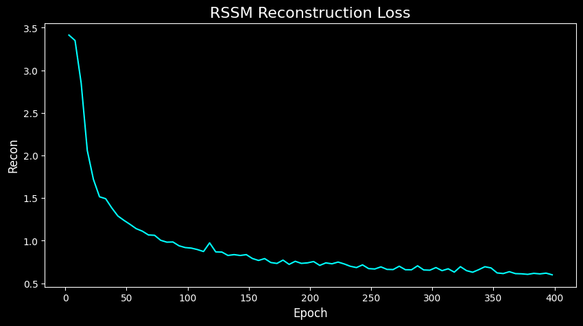

# Cookie-Run-AI-v3
Play in an environment where an AI learns the first stage of Cookie Run, “The Witch's Oven,” and generates the next screen in real time based on your input.  

**Previous Version:**  
- https://github.com/Jeon-ChanYoung/Cookie-Run-AI
- https://github.com/Jeon-ChanYoung/Cookie-Run-AI-v2

<br>

| Item | Detail |
|------|--------|
| **Observation Size** | 128×256 pixels |
| **Action Space** | 3 actions (None, Jump, Slide) |
| **Training Data** | 50 real gameplay videos (~48,000 frames) |

<br>

## Training Data Distribution

> **Total Frames: 47,704** (from 50 real gameplay videos)

| Action | Label | Frames | Ratio |
|:------:|-------|-------:|------:|
| 0 | None | 35,773 | 75.0% |
| 1 | Jump | 1,249 | 2.6% |
| 2 | Slide | 10,682 | 22.4% |

<br>
  
## Real


<br>
  
## Fake (AI-generated)


#### Model Architecture & Improvements

This project is an **enhanced version of Cookie-Run-AI v2**, featuring significant architectural improvements to solve the training bottlenecks observed in the previous version. 

| Feature | v1 | v2 | **v3 (Current)** |
|---------|----|----|------------------|
| **Architecture** | End-to-end RSSM | Two-stage (VQ-VAE $\rightarrow$ RSSM) | **Two-stage (FSQ $\rightarrow$ RSSM)** |
| **Quantization** | None (Continuous) | Vector Quantization (EMA) | **Finite Scalar Quantization (FSQ)** |
| **Codebook Size ($K$)** | - | 256 | **64** (Levels: [4, 4, 4]) |
| **Code Dim ($D$)** | - | 8 | **3** |
| **Spatial Resolution** | Pixel level | 16 x 32 (512 tokens) | **8 x 16 (128 tokens)** |
| **CNN Backbone** | Standard CNN | Standard ResNet | **Enhanced ResNet (deeper)** |

<br>

### Experiment
**The Bottleneck in v2:**  
When using a token grid of 512 tokens (16×32) with a codebook size of 256, the RSSM training consistently plateaued at an early stage. The RSSM decoder had to solve a highly complex prediction problem: predicting one of 256 categories for each of the 512 spatial tokens at every step. This substantially increased the reconstruction burden on the world model and limited downstream accuracy.

**The Solution in v3:**  
To address this, we implemented **FSQ (Finite Scalar Quantization)** and aggressively reduced the complexity of the latent space:
1. **Token Compactness:** Reduced the spatial token resolution from 16×32 to **8×16** (128 tokens).
2. **Simplified Codebook:** Reduced the codebook size ($K$) from 256 to **64** and dimensions ($D$) from 8 to **3**.
3. **Enhanced Autoencoder:** Such extreme compression (roughly a 1000:1 ratio) could degrade reconstruction quality. To compensate, we **substantially strengthened both the encoder and decoder architectures** (adding DownBlocks, UpBlocks, and more ResBlocks), allowing the tokenizer to preserve visual fidelity despite the much tighter bottleneck.
4. **Optimized RSSM:** Lightweighted and optimized the network module to accommodate the reduced token dimensions.

**Result:** The revised design achieved a significantly better trade-off between token compactness, reconstruction quality, and world model predictability. RSSM training stability and token prediction accuracy have dramatically improved.

<br>

## Loss 

### VQ-VAE Loss


```
Epoch [ 1/30] VQ-VAE loss: 0.203241  recon: 0.014470  vq_l: 0.010847  p_l: 1.779250  usage: 1.0
Epoch [ 2/30] VQ-VAE loss: 0.182763  recon: 0.012679  vq_l: 0.011716  p_l: 1.583680  usage: 1.0
Epoch [ 3/30] VQ-VAE loss: 0.167650  recon: 0.011198  vq_l: 0.011293  p_l: 1.451597  usage: 1.0
Epoch [ 4/30] VQ-VAE loss: 0.159327  recon: 0.010206  vq_l: 0.011196  p_l: 1.379252  usage: 1.0
Epoch [ 5/30] VQ-VAE loss: 0.159627  recon: 0.010195  vq_l: 0.012017  p_l: 1.374150  usage: 1.0
...
Epoch [26/30] VQ-VAE loss: 0.136206  recon: 0.007938  vq_l: 0.011916  p_l: 1.163512  usage: 1.0
Epoch [27/30] VQ-VAE loss: 0.136079  recon: 0.007839  vq_l: 0.012115  p_l: 1.161231  usage: 1.0
Epoch [28/30] VQ-VAE loss: 0.136079  recon: 0.007839  vq_l: 0.012115  p_l: 1.161231  usage: 1.0
Epoch [29/30] VQ-VAE loss: 0.135549  recon: 0.007781  vq_l: 0.011987  p_l: 1.155040  usage: 1.0
Epoch [30/30] VQ-VAE loss: 0.134972  recon: 0.007722  vq_l: 0.011902  p_l: 1.149331  usage: 1.0
```

<br>

### RSSM Loss


<br>


<br>


```
Epoch [  1/100] RSSM loss: 3.428530  recon: 3.415260  kl: 1.327025  acc: 0.3446
Epoch [  2/100] RSSM loss: 2.967180  recon: 2.941917  kl: 2.526307  acc: 0.4186
Epoch [  3/100] RSSM loss: 2.726436  recon: 2.695507  kl: 3.092921  acc: 0.4796
Epoch [  4/100] RSSM loss: 2.506273  recon: 2.477390  kl: 2.888293  acc: 0.5286
Epoch [  5/100] RSSM loss: 2.510147  recon: 2.480252  kl: 2.989504  acc: 0.5280
...
Epoch [ 96/100] RSSM loss: 1.803927  recon: 1.768754  kl: 3.517291  acc: 0.7188
Epoch [ 97/100] RSSM loss: 1.845641  recon: 1.801281  kl: 3.436019  acc: 0.7082
Epoch [ 98/100] RSSM loss: 1.817078  recon: 1.783470  kl: 3.360827  acc: 0.7163
Epoch [ 99/100] RSSM loss: 1.858833  recon: 1.823287  kl: 3.554642  acc: 0.7027
Epoch [100/100] RSSM loss: 1.825670  recon: 1.791427  kl: 3.424293  acc: 0.7124
```

Here, "Accuracy" refers to the ratio of predicted VQ token indices that match the actual VQ tokens.  

<br>

## How to Run  
**1. Clone the repository and install dependencies:** 
```
git clone https://github.com/Jeon-ChanYoung/Cookie-Run-AI-v3.git
pip install -r requirements.txt
```

<br>

**2. Setup Pre-trained Model:**  
Download the pre-trained weights (vqvae_ep30.pth, rssm_ep100.pth) from the Releases page and place them in the directory structure as follows:  
```
model_params/
    └── rssm_ep400.pth
    └── vqvae_ep30.pth
```
If model_params does not exist, create it.  

<br>

**3. Run the main.py(FastAPI-based)**  
```
python main.py
```

<br>

## Simulation  
<!--  -->

- ⬆️ Arrow Up: Jump
- ⬇️ Arrow Down: Slide
- 🔄 R Key: Reset
