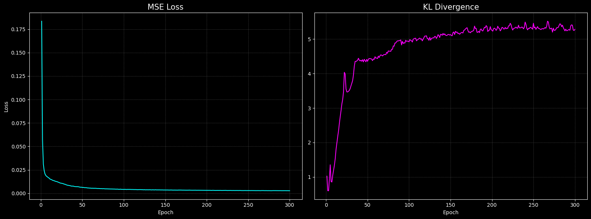

# Cookie-Run-AI
Play in an AI-generated environment by learning the first stage of Cookie Run Ovenbreak, "The Witch's Oven."

The size of the observation is 128×256 pixels, and the action space consists of three actions: none, jump, and slide.
The training data consists of 31 real gameplay videos, totaling approximately 27,000 frames.

## Real


## Fake (AI-generated)


## Loss 

  
```
Ep    1 | Recon: 99355.41 | MSE: 0.183514 | KL:  1.024
Ep    2 | Recon: 93150.23 | MSE: 0.057269 | KL:  0.601
Ep    3 | Recon: 91861.38 | MSE: 0.031047 | KL:  0.600
Ep    4 | Recon: 91526.65 | MSE: 0.024237 | KL:  0.951
Ep    5 | Recon: 91349.94 | MSE: 0.020642 | KL:  1.353
...
Ep  296 | Recon: 90469.11 | MSE: 0.002722 | KL:  5.413
Ep  297 | Recon: 90470.75 | MSE: 0.002755 | KL:  5.401
Ep  298 | Recon: 90468.18 | MSE: 0.002703 | KL:  5.264
Ep  299 | Recon: 90467.58 | MSE: 0.002691 | KL:  5.248
Ep  300 | Recon: 90469.53 | MSE: 0.002730 | KL:  5.282
```
MSE represented the reconstruction loss of the “Gaussian log-likelihood” as the loss of MSE. 

## Simulation UI

